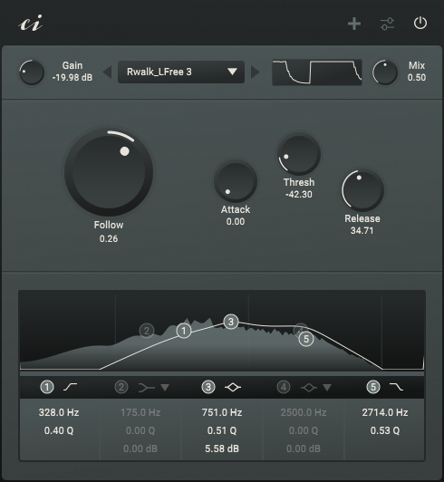

# Tumult
Tumult makes noise. Tumult texturizes, accentuates and adds warmth and age. Tumult comes with 50 hand-picked noises. You can play them raw, let them follow your sounds, or duck them away. It comes with an 5-band EQ that lets you shape the noises to your liking. Tumult is a free and open source 64bit VST3 effect plugin for Linux and Windows.

Download the latest version here: https://github.com/consint/Tumult/releases/

## How it works
The effect plugin plays one of 50 noises that can be added to the actual audio signal using the ‘Mix’ knob. The ‘Gain’ knob controls the volume, and the equaliser controls the frequency response of the noise - the actual audio signal is not affected.

In ‘Raw’ mode, the noise is played back without any influence. In ‘Duck’ mode, the noise is ducked away by the actual audio signal. In ‘Folllow’ mode, the noise only plays when the actual audio signal is playing (depending on the threshold).

## How to install
1. Unzip the downloaded file.
2. Copy the entire ‘Tumult.vst3’ folder into the vst folder of your operating system. For Linux, this is the .vst3 folder in the home directory. For Windows, this is in ‘C:\\Program Files\\Common Files\\VST3’.
3. Copy the ‘TumultSamples’ folder wherever you want, for example to a location where you also save other samples.
4. In order for Tumult to **find the samples**, the path to the sample folder must be specified in the plugin. To do this, open the plugin in a host of your choice, open the settings, select ‘Change Sample Folder Location’ and select the ‘TumultSamples’ folder. For the changes to take effect, you must remove the plugin from the host and reload it.

## How to use
### General
Buttons can be adjusted by dragging. If you hold Ctrl or Alt while dragging, the knob can be fine-tuned. If you press Shift while clicking on a button, you can enter a value as text.

### Interface
#### Bypass
Bypass the Plugin.

#### Settings
The ‘ci‘ logo or the settings icon shows and closes the settings.

#### Gain
Adjusts the volume of the noise. I have placed a **clipper** behind the noise so that gain values above 0 will distort the noise.

#### Noise selection
The noise can be selected using the combo box or the two arrows next to it. The different sounds are divided into six categories, whereby all sounds in the ‘Noise’ category are generated and the sounds in all other categories are samples.

#### Mix
Blends between the actual signal and the noise.

#### Raw/Duck/Follow
The large knob on the left-hand side determines the behaviour of the plug-in. In the centre position, it plays the noise ‘Raw‘, without any influence. Turned to the right, the noise follows the audio signal. Only the ‘Thresh’, ‘Attack’ and ‘Release’ knobs are displayed for the follow settings. Turned to the left, the noise is ducked away by the audio signal. Only the ‘Thresh’, ‘Attack’ and ‘Release’ knobs are displayed for the ducking settings.

#### Thresh
Determines the level of the audio signal at which the noise follows the signal or is ducked away by it.

#### Attack
Determines the time it takes for the noise to play at full volume after the ‘Follow’ or ‘Duck’ detection.

#### Release
Determines the time it takes for the noise to stop playing after the end of the ‘Follow’ or ‘Duck’ detection.

#### Equalizer
Works like any conventional EQ. Left-click to activate a filter. Right-click to deactivate it. You can move the individual filters using drag and drop. The Q factor can be set using the mouse wheel. Band 1 is a high-pass filter. Band two can be switched between a bell and low shelf filter. Band 3 is a bell filter. Band 4 can be switched between a bell and a high shelf filter. Band 5 is a low-pass filter.

### Settings
#### Show Spectrum Analyzer
‘Enable’ or ‘Disable’ the spectrum analyzer behind the EQ.

#### Host Sync
If ‘Host Sync’ is enabled, the noise only plays when the plug-in host is playing. If it is disabled, the noise always plays.

#### UI Zoom Factor
Sets the size of the UI.

#### Streaming Mode
Determines how the noise samples are loaded. Should hardly make a difference due to the small sample size.

#### Change Sample Folder Location
The sample folder can be selected here.

## How to compile
1. Install or compile [Faust](https://github.com/grame-cncm/faust) > 2.74.6
2. Compile [Hise](https://github.com/christophhart/HISE) with Faust enabled (see https://forum.hise.audio/topic/6746/updated-build-instructions). For help you can watch the great videos by David Healey ([Linux](https://www.youtube.com/watch?v=rUuEoJk6FF8), [Windows](https://www.youtube.com/watch?v=D3kthNOQ9_s), [MacOS](https://www.youtube.com/watch?v=zeLeCSNh0XM)).
3. Clone this repository or download the Tumult source code.
4. Open Hise, select ‘File -> Load Project’ and select the Tumult folder. You do not need to load the file ‘tumult.xml’ as we need to compile the ‘DSP Networks’ first.
5. Go to ‘Export’ and select ‘Compile DSP Networks as dll’. On Windows this will compile the DSP Networks. On Linux you have to execute the file ‘.../Tumult/DspNetworks/Binaries/batchCompileLinux.sh’ in the terminal.
6. Restart Hise and load the file ‘tumult.xml’.
7. Select ‘Export -> Export as FX plugin’. 
8. 
9. WINDOWS COMPILATION. 
10. 
11. On Linux you have to execute the file ‘.../Tumult/Binaries/batchCompileLinux.sh’ in the terminal.

If you need help you can ask me or have a look at the great [Hise forum](https://forum.hise.audio/).

## Credits
Many thanks to Christoph Hart for making [Hise](https://github.com/christophhart/HISE). Thanks to David Healey for the great [Hise tutorials](https://www.youtube.com/@DHealey/featured). Thanks to the whole [Hise forum](https://forum.hise.audio/) for the friendly interaction and the great mutual help and support.

All samples are from [freesound.org](https://freesound.org/) and are licensed under a ‘Creative Commons 0’ licence. My thanks go to all the producers who created and provided these samples.

You can find all links to the original samples here (as of September 2024):

#### Vinyl
* Vinyl 1: https://freesound.org/s/699693/
* Vinyl 2: https://freesound.org/people/DWSD/sounds/139091/
* Vinyl 3: https://freesound.org/s/515129/
* Vinyl 4: https://freesound.org/s/682193/
* Vinyl 5: https://freesound.org/people/scottyhigh20/sounds/493122/

#### Static
* Electric 1: https://freesound.org/people/Wakerone/sounds/393066/
* Electric 2: https://freesound.org/people/_MC5_/sounds/524934/
* Old Film: https://freesound.org/people/joedeshon/sounds/324404/
* Gramophone: https://freesound.org/people/lollosound/sounds/387005/
* Radio: https://freesound.org/people/martinimeniscus/sounds/199438/
* TV: https://freesound.org/people/DiArchangeli/sounds/116395/

#### Machine
* Computer: https://freesound.org/people/Gutek/sounds/350928/
* Dough: https://freesound.org/people/frenkfurth/sounds/650536/
* Fridge 1: https://freesound.org/people/TRP/sounds/616830/
* Fridge 2: https://freesound.org/people/TRP/sounds/573933/
* Furnance: https://freesound.org/people/kyles/sounds/454030/
* Letters: https://freesound.org/people/SortsApostata/sounds/233594/
* Oven: https://freesound.org/people/felixdembinski/sounds/659645/
* Air 1: https://freesound.org/people/felix.blume/sounds/711101/
* Air 2: https://freesound.org/people/kyles/sounds
* Vending: https://freesound.org/people/HECKFRICKER/sounds/730438/
* Washing: https://freesound.org/people/afnan808/sounds/384121/

#### Hum
* Alien 1: https://freesound.org/people/0ktober/sounds/188831/
* Alien 2: https://freesound.org/people/pjborg/sounds/416323/
* Electric 1: https://freesound.org/people/joedeshon/sounds/320871/
* Electric 2: https://freesound.org/people/hiddenpersuader/sounds/159633/
* VHS: https://freesound.org/people/jacobzeier/sounds/166178/

#### World
* City 1: https://freesound.org/people/itinerantmonk108/sounds/617560/
* City 2: https://freesound.org/people/Joao_Janz/sounds/473699/
* City 3: https://freesound.org/people/risto_alcinov/sounds/371250/
* Crowd: https://freesound.org/people/eguobyte/sounds/360703/
* Fire 1: https://freesound.org/people/Nox_Sound/sounds/558967/
* Fire 2: https://freesound.org/people/tc630/sounds/47835/
* Fire 3: https://freesound.org/people/HECKFRICKER/sounds/729395/
* Fire 4: https://freesound.org/people/kyles/sounds/637524/
* Rain 1: https://freesound.org/people/WilliamJMeyer/sounds/467172/
* Rain 2: https://freesound.org/people/giddster/sounds/719059/
* Rain 3: https://freesound.org/people/BonnyOrbit/sounds/645918/
* Rain 4: https://freesound.org/people/lastraindrop/sounds/708153/
* Rain 5: https://freesound.org/people/giddster/sounds/437338/
* Underground: https://freesound.org/people/kyles/sounds/450924/
* Waterfall 1: https://freesound.org/people/BassmanJourney/sounds/632107/
* Waterfall 2: https://freesound.org/people/blaukreuz/sounds/195715/
* Waterfall 3: https://freesound.org/people/zazz.sound.design/sounds/727861/
* Waterfall 4: https://freesound.org/people/Tom_Kaszuba/sounds/660255/